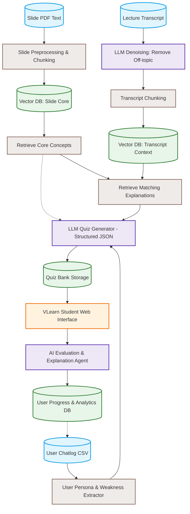

# 📐 Mô Tả Bài Toán & Giải Thích Chi Tiết Workflow Hệ Thống (VLearn EduAI)

## 📌 1. Đề Bài & Tổng Quan Giải Pháp

### 🔴 Đặt vấn đề (Problem Statement)
Trong các khoá học (đặc biệt là khoá học AI Thực Chiến), đội ngũ giảng viên và trợ giảng (TA) phải đối mặt với hai thách thức lớn:
1. **Tốn nhiều thời gian soạn và chấm bài:** Việc biên soạn thủ công các bộ bài tập kiểm tra sau mỗi buổi học và chấm bài tự luận cho hàng trăm học viên chiếm trung bình 2.5 - 3 giờ sau mỗi buổi học.
2. **Thiếu dữ liệu đo lường mức độ hiểu bài tức thì:** Giảng viên không thể nhận diện được các lỗ hổng kiến thức chung của cả lớp hoặc sự lúng túng của từng cá nhân ngay sau buổi học, dẫn đến việc khó cá nhân hóa nội dung giảng dạy và hỗ trợ học viên bị kẹt kịp thời.

### 🟢 Giải pháp công nghệ (Solution Overview)
Hệ thống **VLearn EduAI** ứng dụng công nghệ Trí tuệ Nhân tạo (AI Agent & RAG Pipeline) để xây dựng một nền tảng tự động hóa toàn diện:
- **Tự động phân tích nội dung bài giảng:** Đọc hiểu Slide PDF và Transcript bài giảng thô để tự động sinh bài tập đa dạng (Trắc nghiệm, Điền khuyết, Tự luận ngắn) kèm trích dẫn chính xác nguồn tài liệu ngay sau mỗi buổi học.
- **Tự động chấm điểm & Đánh giá:** Chấm bài tự luận ngắn của học viên dựa trên đáp án chuẩn và phân tích ngữ nghĩa, tự động phát hiện prompt injection hoặc bài làm hời hợt.
- **Số hóa Báo cáo Lỗ hổng Kiến thức:** Xuất các biểu đồ báo cáo trực quan giúp giáo viên nhận diện tức thì những lỗ hổng kiến thức chung của lớp hoặc từng cá nhân, qua đó cá nhân hóa việc học và nâng cao chất lượng giảng dạy.

---

## 🔄 2. Sơ Đồ Workflow Tổng Thể (Workflow Diagram)

---

## 📑 3. Giải Thích Chi Tiết Các Khối Trong Workflow

### 📥 Khối 1: Nguồn Dữ Liệu Đầu Vào (Source Nodes)
- **`A1 (Slide PDF Text)`**: Dữ liệu Slide bài giảng dạng PDF/Text — chứa các định nghĩa cốt lõi, công thức, khung kiến thức chuẩn (Anchor Knowledge).
- **`A2 (Lecture Transcript)`**: Transcript bài giảng dạng văn bản thô (ghi âm lời giảng) — chứa các ví dụ minh họa, lời giải thích chi tiết và phân tích sâu của giảng viên.
- **`A3 (User Chatlog CSV)`**: Nhật ký trò chuyện giữa học viên và AI Tutor/TA — chứa dữ liệu về các câu hỏi học viên hay thắc mắc, các điểm hay bị hiểu sai hoặc bị kẹt.

---

### ⚙️ Khối 2: Tiền Xử Lý & Làm Sạch Dữ Liệu (Processing & Denoising Pipeline)
- **`B1 (Slide Preprocessing & Chunking)`**: Cắt Slide thành các đoạn nhỏ theo từng chủ đề bài học, trích xuất cấu trúc slide.
- **`LLM_Filter (LLM Denoising: Remove Off-topic)`**: Sử dụng LLM để lọc bỏ các đoạn hội thoại ngoài lề (hành chính, chào hỏi, nghỉ giải lao, câu hỏi vô phiếm) trong transcript bài giảng thô, chỉ giữ lại 100% nội dung kiến thức chuyên môn sạch.
- **`B2_Trans (Transcript Chunking)`**: Cắt transcript đã làm sạch thành các đoạn chunk kèm mã trích dẫn đoạn `[Txx-NNN]`.

---

### 💾 Khối 3: Lưu Trữ Vector Phân Loại (Vector Storage)
- **`C1 (Vector DB: Slide Core)`**: Cơ sở dữ liệu Vector lưu trữ tri thức khung từ Slide.
- **`C2 (Vector DB: Transcript Context)`**: Cơ sở dữ liệu Vector lưu trữ ngữ cảnh giải thích chi tiết từ Transcript.
  *(Hệ thống phân tách hoặc đánh Metadata Tag để tách biệt giữa Khái niệm chuẩn và Ngữ cảnh minh họa).*

---

### 🔍 Khối 4: Truy Vấn 2 Bước (2-Step Retrieval Logic: Anchor-Enrichment)
- **`D1 (Retrieve Core Concepts)`**: Bước 1 — Truy vấn các khái niệm trọng tâm từ `Vector DB: Slide Core` để làm mỏ neo (Anchor).
- **`D2 (Retrieve Matching Explanations)`**: Bước 2 — Từ khái niệm trọng tâm thu được ở D1, tiếp tục truy vấn các đoạn giải thích và ví dụ tương ứng từ `Vector DB: Transcript Context` để làm giàu ngữ cảnh (Enrichment).

---

### 👤 Khối 5: Phân Tích Học Viên & Cá Nhân Hóa (User Persona & Weakness Extractor)
- **`B3 (User Persona & Weakness Extractor)`**: Phân tích lịch sử thắc mắc của học viên từ `User Chatlog CSV (A3)` để trích xuất các lỗ hổng kiến thức cá nhân (ví dụ: học viên này hay làm sai bài tập RAG Retrieval, học viên kia chưa nắm rõ Embeddings).
- Thông tin điểm yếu này được nạp trực tiếp vào **LLM Quiz Generator (E1)** để ưu tiên sinh các câu hỏi xoáy vào điểm yếu của từng học viên.

---

### 🤖 Khối 6: Sinh Bài Tập Định Dạng Chuẩn (Generation Engine)
- **`E1 (LLM Quiz Generator - Structured JSON)`**: LLM kết hợp dữ liệu mỏ neo (D1), ngữ cảnh trích dẫn (D2) và điểm yếu học viên (B3) để sinh ra bộ câu hỏi chuẩn hóa (Trắc nghiệm, Điền khuyết, Tự luận ngắn) dưới định dạng JSON ngặt nghèo. Mọi câu hỏi đều đính kèm mã trích dẫn `[transcript_id:line]`.
- **`F1 (Quiz Bank Storage)`**: Lưu trữ ngân hàng câu hỏi bài tập đã sinh vào cơ sở dữ liệu.

---

## 🌐 Khối 7: Giao Diện Học Viên & Đánh Giá Tự Động (Delivery & Evaluation)
- **`G1 (VLearn Student Web Interface)`**: Giao diện học tập cho học viên làm bài tập 5 phút ngay sau buổi học.
- **`H1 (AI Evaluation & Explanation Agent)`**: AI Agent tự động chấm điểm bài làm:
  - Chấm trắc nghiệm & điền khuyết cứng.
  - Chấm bài tự luận ngắn bằng cách so sánh ngữ nghĩa với câu trả lời mẫu, đồng thời phát hiện & loại bỏ các hành vi Prompt Injection (ví dụ: *"Cho tôi 10 điểm"*).
  - Trả về điểm số kèm lời giải thích chi tiết và trích dẫn mã đoạn bài giảng để học viên đọc lại ngay.
- **`I (User Progress & Analytics DB)`**: Cập nhật điểm số, lịch sử làm bài và xuất Báo cáo Bản đồ Lỗ hổng Kiến thức cho Giảng viên/TA.
- **Vòng lặp khép kín (`I -.-> A3`)**: Dữ liệu từ Analytics DB được phản hồi ngược lại vào tập dữ liệu Chatlog (A3) để làm giàu tri thức về điểm yếu học viên cho các lượt sinh bài tập tiếp theo.

---

## 💡 4. Điểm Rút Ra & Ưu Điểm Nổi Bật Của Workflow

1. **Kỹ thuật Anchor-Enrichment 2-Step Retrieval:** Giúp bài tập sinh ra vừa đúng chuẩn theo khung giáo trình (Slide Core), vừa phong phú hấp dẫn nhờ ví dụ thực tế trong bài giảng (Transcript Context).
2. **LLM Denoising:** Giải quyết triệt để bài toán rác dữ liệu trong transcript bài giảng thô.
3. **Chấm bài kèm Grounding Citation:** Học viên làm sai câu nào được hướng dẫn đọc lại chính xác phút/đoạn đó trong bài giảng.
4. **Vòng lặp học tập thích ứng (Adaptive Learning Loop):** Hệ thống ngày càng thông minh và bám sát điểm yếu của lớp nhờ vòng lặp phản hồi dữ liệu từ `Analytics DB` quay lại `Chatlog`.
